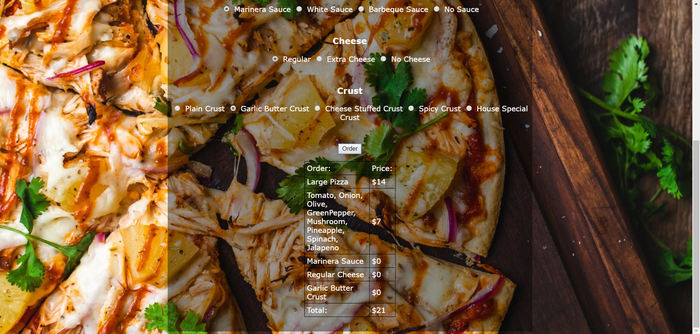
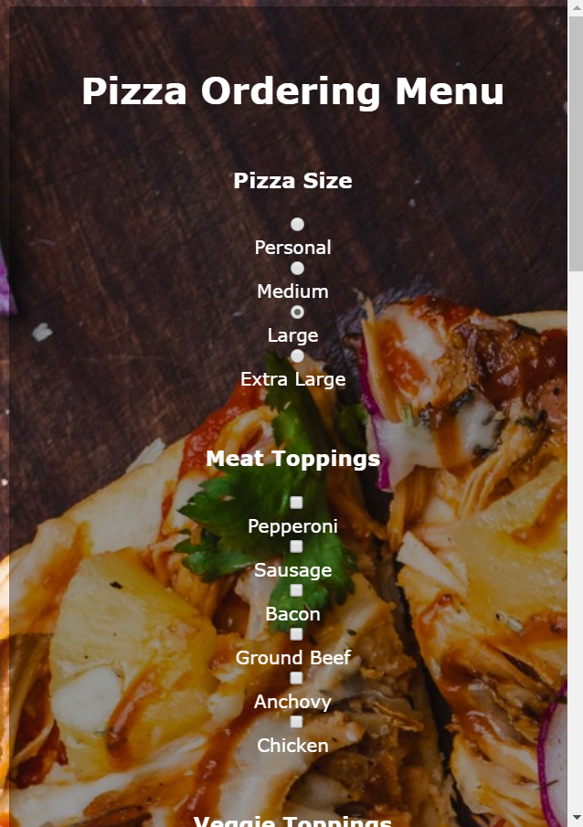
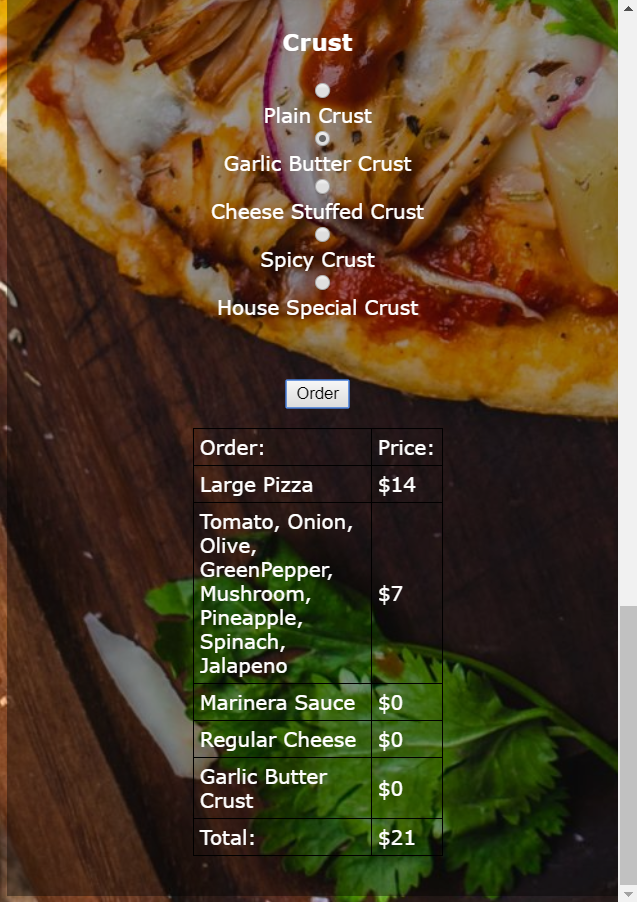

# TTA JavaScript Project
Practice project from The Tech Academy's JavaScript course.

## Pizza Ordering Menu Project
The Pizza Ordering Menu Project calculates the final pizza price based on selections. I used pure CSS to implement a mobile first responsive design.

[Click here to see the code.](https://github.com/rbmanez/TTA-JavaScript-Projects/tree/master/js-pizza-project-solution)

#### Pizza Project Screenshot on Desktop (top of page)

#### Pizza Project Screenshot on Desktop (bottom of page)

#### Pizza Project Screenshot on Mobile (top of page)

#### Pizza Project Screenshot on Mobile (bottom of page)

